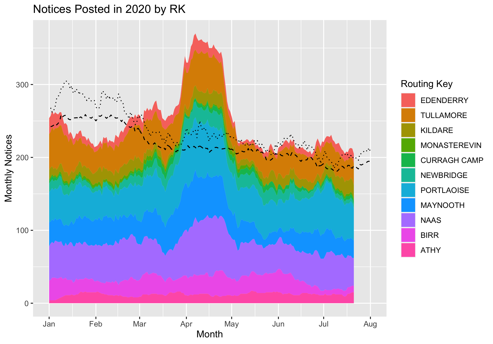

```{r setup, include=FALSE}
knitr::opts_chunk$set(echo = FALSE, message = FALSE)
library(tidyverse)
library(lubridate)
```

There is growing unease and concern in Ireland about the recent increase in cases of COVID-19 in Ireland. Three counties---Laois, Offaly, Kildare (LOK)---endured renewed lockdown, clusters have been identified in meat processing plants and Direct Provision centres, generational divisions are sharpening, with the perception that young people are flouting the rules, and, against this backdrop, schools are returning. Some consolation perhaps is that while case numbers have risen, fatalities associated with the disease are not rising at comparable levels. But could this be a false sense of security? Using postings of death notices to RIP.ie, we identify the Eircode regions that have shown high levels of posting through the summer. The highest by far is in the heart of the LOKdown counties: the Porlaoise Eircode (R32), where posts reached almost double their normal levels at the start of July.


```{r, out.width='90%', fig.align='center', fig.cap="The Portlaoise Eircode (beginning R32) experienced excess postings to RIP.ie in April 2020 when posts topped 70 in a 28-day total, almost double the normal levels of approximately 45. A second peak occurred near the start of July. This time posts topped 60, when normal levels would typically drop to below 35 for this time of year. These levels were the highest ever recorded in the Portlaoise Eircode for this time of year. The 2020 postings (solid line), previous maxima (dotted line) and mean posts (dashed line) are based on 28-day centered tallies of posts to RIP.ie."}
knitr::include_graphics('aggregated_by_routing_key_portlaoise_mod.png')
```

> Explore for yourself the number of postings to RIP.ie in your area, by using the drop-down list below: 

<iframe src="https://rstudioserver.hamilton.ie:3838/users/aparnell/RIP_data/" class="l-screen-inset shaded" height = "1000px"></iframe>

While we note postings to RIP.ie showed peaks above previous maxima in Northwest Cavan (focused around Belturbet), West Mayo (F28, F23), Westmeath (Athlone (N37) and Mullingar(N91)), Carlow (R93, R21), Kilkenny (R95), and Dublin West (D15, K78 LUCAN, D22, D24), the question of whether these increased postings are statistically significant indicators of excess mortality is one we continue to work on. Excess postings to RIP.ie also does not mean that deaths were associated with COVID-19. However, we live in days of suspicion rather than rigour, which is why we present these findings now.

<!-- From 12th of June to 12th August, N deaths were assigned to COVID-19 in the Republic of Ireland.  -->

<!-- # Was there a summer increase in postings to RIP.ie?  -->
# Did postings to RIP.ie increase in summer?

At a national and county level, the answer is 'No'. National levels of posting to RIP.ie have remained at a normal level. At county level, the picture is much the same. A number of counties have shown an upturn in the numbers of notices posted. However, this upturn is in a normal range in comparison with previous recent years.

The initial spread of COVID-19 in Ireland, as elsewhere, was explosive and resulted in 11 of 26 counties in the Republic posting the highest number of death notices for any April---for 7 of these counties, [April 2020 was the month with the highest postings to RIP.ie ever](https://www.rte.ie/brainstorm/2020/0505/1136496-death-notices-ireland-coronavirus/). The unprecedented measures introduced to combat the spread were effective and by May the tide of excess postings had ebbed. 

<!-- The recent rise in the number of coronavirus cases in Ireland has alarmed a public weary after almost six months of restrictions. But there has also been a welcome fall-off in the numbers of people dying and being hospitalised due to the disease.In the period from August 1st to August 26th, there were 2,300 confirmed cases of the disease in the State, but just 13 deaths.(https://www.irishtimes.com/news/health/covid-19-why-are-deaths-and-hospitalisations-falling-so-dramatically-1.4340185) -->

A resurgence of the disease was always going to appear differently from this initial wave.  Clusters were always likely to re-emerge and the battle against the resurgence will take the form of skirmishes, dependent on tracking and tracing. And clusters of cases have re-emerged. Most notably in Laois, Offaly, and Kildare---the counties that were locked down again during July (so-called LOKdown). A pattern of new cases stretching through Laois and Kildare along the N7/M7 emerged during the summer, with Edenderry being the centre of the Offaly outbreak---see map by David Higgins [here](https://twitter.com/higginsdavidw/status/1295407700222844930?s=20).

<!-- Firstly, it is well worth noting that the disease was never eradicated in Ireland. In fact, even keeping the R number below 1, [there would have been less than 50% chance of eradication this year.](https://aminshn.shinyapps.io/SEIR/) The R number is not at time of writing below 1. -->

<!-- # ```{r, out.width='80%', fig.align='center', fig.cap='Increase in cases of COVID-19 by Electoral Division in LOKdown counties from 12th of June to the 12th August derived from the [official Government dashboard](https://covid19ireland-geohive.hub.arcgis.com/). Map made by [David Higgins](https://twitter.com/higginsdavidw) based on data from [Tony Kent](https://twitter.com/2NilDown).'} -->
<!-- # knitr::include_graphics('higgins_lokdown_map.png') -->
<!-- # ``` -->

We have looked at the notices posted to RIP.ie in the EirCodes of the LOKdown regions to investigate any evidence for excess postings relative to the time of year. Excess postings to RIP.ie were a potent indicator of the deadliness of COVID-19 in the first wave of the disease at county level but, given the more random and localised nature typical of a resurgence, we wanted to investigate finer scale geographies. We consider the [3-digit Eircodes](https://www.autoaddress.ie/blog/autoaddressblog/2017/06/17/it-is-surprisingly-easy-to-determine-an-eircode-routing-key-for-any-address) as a relatable geography. These do not have much geographic fidelity, by which we mean they do not match existing administrative boundaries, such as county bounds, nor do they encompass a consistent areal or population unit. However, they are societally relateable as everyone knows (or can find) their Eircode. 

```{r, out.width='100%', fig.align='center', fig.cap="The 3-digit Eircodes of the LOKdown counties. These vary widely in size and consequently vary widely in terms of mean posts to RIP.ie. In considering excess postings, we merge Eircodes together to give a minimum average of 20 posts to RIP.ie in a 28-day period. In this instance, it involves combining Edenderry (R45) into Tullamore (R35), and combining Athy (R14), Monasterevin (W34), Kildare (R51), Athy (R14), and Curragh Camp (R56) into a West Kildare grouping. Colour indicates average number of monthly posts to RIP.ie."}
knitr::include_graphics('mean_posts_by_routing_key_LOK_mod.png')
```

To compare the excess postings at Eircode level, we needed to combine the Eircodes with low numbers of postings and normalise each area. We targeted an average number of monthly mean postings of 20. In this instance, it involves combining Edenderry (R45) into Tullamore (R35), and combining Athy (R14), Monasterevin (W34), Kildare (R51), and Curragh Camp (R56) into a West Kildare grouping. Normalisation of excess mortality measures is typically done by dividing by population or age-weighted population, this gives an estimate of [P-scores](https://ourworldindata.org/covid-excess-mortality), a percentage excess relative to population. In the case of postings to RIP.ie, there are known biases, with some counties under posting relative to official death notices and others overposting. To normalise, we therefore use an internal measure from RIP.ie and report excess postings relative to the monthly average posts. 

The proportional postings for the six grouped Eircode regions are shown below. Proportions equal to one are typical levels, two indicates twice the normal levels. The dotted line shows the maximum previous level of posting. Five out of six of the Eircode regions show peaks above the previous maximum occurring in April. This is the effect of the first wave of mortality related to COVID-19. There is a large geographic contrast between the westernmost Eircode of Birr, which did not exceed previous maxima in April, and Maynooth, which experienced excess postings that almost reached three times the normal level. The Maynooth Eircode, W23, encompasses the town of Leixlip where [35 deaths were attributed to COVID in one nursing home](https://www.irishtimes.com/news/ireland/irish-news/the-human-cost-of-covid-19-ireland-s-care-homes-with-the-most-deaths-revealed-1.4264170)---the highest in the country.   

We have already seen that in early July, the Portlaoise Eircode (R32) experienced high excess posting. This comparison plot shows the July peak as greater proportionally, relative to the time of year, than the April peak. We should emphasize that this is not focused on the town of Portlaoise and has the highest levels between Portlaoise and Monasterevin. In addition to the Portlaoise Eircode increase, increases at similar times were seen in the Naas and Kildare West Eircodes. 

<!-- ```{r, out.width='90%', fig.align='center', fig.cap='...'} -->
<!--  -->
<!-- ``` -->

```{r, out.width='90%', fig.align='center', fig.cap='Postings to RIP.ie as a proportion of average posts. A 28-day centered sum divided by the mean monthly postings is shown. A proportion equal to 1 indicates normal levels. The dotted line indicates the previous maximum level of posting. Smaller postal regions were merged together. Edenderry (R45) was merged with Tullamore (R35). Kildare, Curragh Camp, Newbridge, Monasterevin, and Athy were merged to the region of West Kildare.'}
load("town_in_rk_count_geo_merged_lok.Rdata")
ref_level <- town_in_rk_count_geo_merged %>% 
  select(Year, Group, Date, Monthly_Notices) %>% 
  filter(Year < 2020 & Year >=2015 ) %>% 
  ungroup() %>%
  group_by(Group,Date) %>% 
  summarize(Monthly_Notices = sum(Monthly_Notices)) %>%
  mutate(DOY=yday(Date)) %>%
  group_by(Group,DOY) %>%
  mutate(Ref_Level = mean(Monthly_Notices), 
         Prev_Max = max(Monthly_Notices))
  

# ggplot()+
#   geom_line(data = town_in_rk_count_geo_merged %>% 
#               filter(Year == 2020), 
#             aes(x=Date,y=Monthly_Notices)) +
#   geom_line(data = ref_level,
#             aes(x=as.Date(DOY,origin="2020-01-01"),y=Ref_Level),linetype="dashed") +
#   geom_line(data = ref_level,
#             aes(x=as.Date(DOY,origin="2020-01-01"),y=Prev_Max),linetype="dotted") + 
#   facet_wrap(facets = vars(Group)) +
#   ggtitle(paste0("Notices Posted in 2020")) +
#   labs(x="",y="Monthly Notices") +
#   theme(axis.text.x = element_text(angle = 90))  +
#   scale_x_date(date_breaks = "1 month", date_labels = "%b",limits=c(as.Date("2020-01-01"),as.Date("2020-08-01")))

# same but by proportion
prop_plot_data <- town_in_rk_count_geo_merged %>% 
  select(Year, Group, Date, Monthly_Notices, DOY) %>% 
  filter(Year == 2020) %>%
  left_join(as_tibble(ref_level %>% 
                        select(Group,DOY,Ref_Level,Prev_Max)),
            by = c("Group","DOY")) %>%
  mutate(Monthly_Proportion = Monthly_Notices/Ref_Level,
         Max_Proportion = Prev_Max/Ref_Level)

# ggplot(prop_plot_data)+
#   geom_line(aes(x=Date,y=Monthly_Proportion-1)) +
#   geom_line(aes(x=Date,y=Max_Proportion-1),linetype="dotted") +
#   facet_wrap(facets = vars(Group)) +
#   ggtitle(paste0("Percentage Change Notices Posted in 2020")) +
#   labs(x="",y="% relative to 2015-2019") +
#   theme(axis.text.x = element_text(angle = 90))  +
#   scale_y_continuous(labels = scales::percent) +
#   scale_x_date(date_breaks = "1 month", date_labels = "%b",limits=c(as.Date("2020-01-01"),as.Date("2020-08-01")))

ggplot(prop_plot_data)+
  geom_line(aes(x=Date,y=Monthly_Proportion)) +
  geom_line(aes(x=Date,y=Max_Proportion),linetype="dotted") +
  facet_wrap(facets = vars(Group)) +
  ggtitle(paste0("Proportional Change Notices Posted in 2020")) +
  labs(x="",y="Proportion relative to 2015-2019") +
  theme(axis.text.x = element_text(angle = 90))  +
  scale_x_date(date_breaks = "1 month", date_labels = "%b",limits=c(as.Date("2020-01-01"),as.Date("2020-08-01")))
```

# The limits of excess mortality

<!-- Explore for yourself the number of postings to RIP.ie in your Eircode area: https://aminshn.shinyapps.io/RIP_data/.  -->

From a decision making perspective, how could you interpret this information? Assuming that the excess postings are a true indicator of actual deaths, it is still not saying that postings above previous maxima are indicative of undiscovered COVID deaths. If you consider a given population, there will be deaths over time, these will have an element of randomness to them. Excess mortality could therefore just appear by chance and be completely unrelated to a consistent single cause such as COVID-19. Yet excess mortality has been a useful indicator of COVID prevalence through this pandemic. My day job is in climate change and we would consider that the excess postings being indicative of undiscovered COVID clusters as a low probability, high impact event. [These are the types of events that have been incorporated into Dutch adaptive planning in response to sea level rise and climate change](https://iopscience.iop.org/article/10.1088/1748-9326/ab666c). This information could be incorporated into decision-making in a way that would be the equivalent of damping the grass to avoid a bushfire. 

Excess, all-cause mortality has been an independent indicator of the deadliness of COVID-19 around the world. Frequently, excess mortality has shown where countries have underestimated deaths associated with the disease. [In Ecuador, more than 10000 excess deaths have been recorded, far higher than officialy reported COVID deaths](https://www.ft.com/content/a2901ce8-5eb7-4633-b89c-cbdf5b386938). In the UK, prompt and open delivery of mortality data charted the tragic rise of the UK to the top of the European COVID mortality charts. Whether a death is attributed to COVID-19 or another cause is not considered by this measure but this doesn't negate the usefulness of excess mortality in charting the impacts of COVID-19. After all, this is how we measure the deadliness of the seasonal flu.

In Ireland, we have a problem estimating excess mortality from official data. The requirement to report deaths officially has a much larger lag than elsewhere. The [European Mortality Monitoring Project, EuroMOMO, noted:](https://www.euromomo.eu/bulletins/2020-17)

> "In Ireland, as a result of very significant delays in death registrations during March and April 2020, due to the COVID-19 pandemic, weekly z-scores of excess all-cause mortality do not reflect current COVID-19 (and non-COVID-19) excess mortality in Ireland."

The lag in official reporting of deaths lead to the use of the death notices website RIP.ie as an indicator for excess mortality. An extensive [HIQA report](https://www.hiqa.ie/reports-and-publications/health-technology-assessment/analysis-excess-all-cause-mortality-ireland) outlined the usefulness of postings to RIP.ie as a near realtime, open source of information. 

<!-- As part of a  -->

<!-- # Further research -->

<!-- In collaboration with... -->

<!-- Explore the limits of the geographical breakdown of this dataset. IAs etc.  -->


<!-- Distill is a publication format for scientific and technical writing, native to the web. -->

<!-- Learn more about using Distill at <https://rstudio.github.io/distill>. -->


