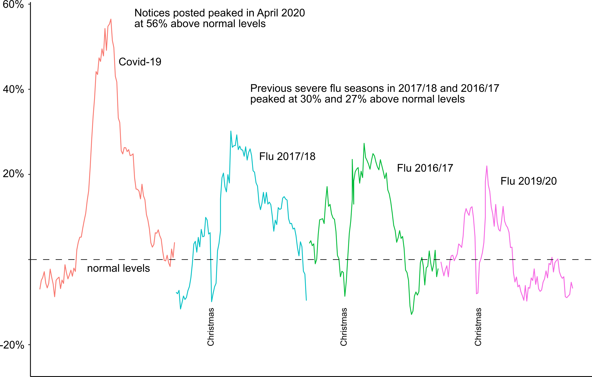
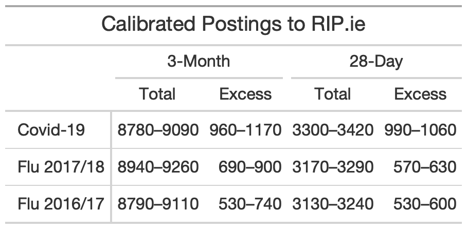
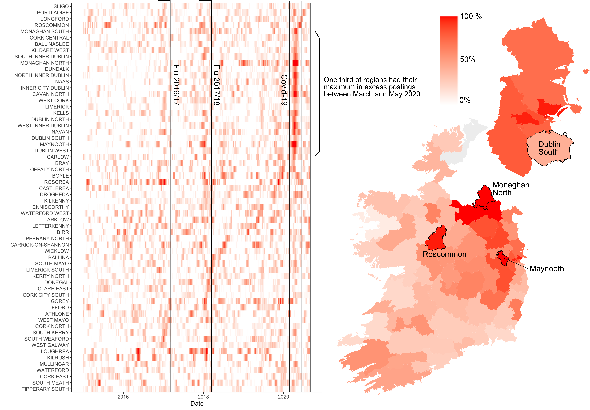
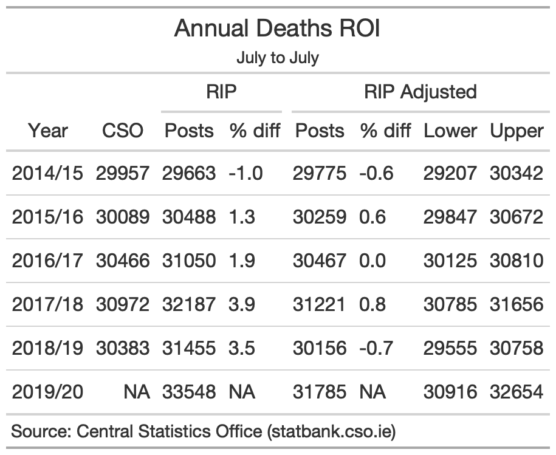

```{r setup, include=FALSE}
knitr::opts_chunk$set(echo = FALSE)
library(tidyverse)
library(lubridate)
```

Summary statistics of mortality associated with COVID-19 belie the fact that the effectiveness and compliance with lockdown stopped Covid-19 in its tracks. Still the disease managed to kill in one month as many people as the worst seasonal flu in recent years did over three months.

[Comments by a senior HSE doctor](https://www.irishtimes.com/news/health/draconian-restrictions-around-covid-19-condemned-by-hse-doctor-1.4352701) that Covid-19 is “much less severe” than the seasonal flu sparked heated debate about the deadliness of Covid-19 and robust defence of the ongoing restrictions and measures to combat the virus. Analysing excess mortality derived from postings to the death notice website RIP.ie, we clearly observe that excess mortality patterns in Ireland during the first wave of the Covid-19 pandemic were not comparable to recent flu seasons: Covid-19 killed more people in one month than the most recent severe flu season did in three. 

```{r, out.width='90%', fig.align='center', fig.cap='Percentage excess postings above normal levels (dashed line) to RIP.ie for Covid-19 and previous flu seasons.'}

```

Headline figures can mask the underlying patterns. There were fewer notices posted to RIP.ie during the Covid-19 period of March–May 2020 than either of the severe flu seasons in December–February in 2017/18 and 2016/17. However, it is excess mortality—here estimated by the number of postings higher than the average postings for that time of year taken from 2014–2020—that is the appropriate measure for estimating the deadly impact of virus outbreaks. Excess mortality requires adjustment for typically higher mortality in the winter months. Subsequently despite lower overall postings excess mortality for the Covid-19 period is almost 40% higher than that recorded for the ‘severe’ flu season of 2017/18.

```{r, out.width='1%', fig.align='center', fig.cap='Total numbers of postings to RIP.ie are calibrated to official mortality figures from 2014–2019. Excess numbers of postings are calculated relative to the seasonal average from 2014–2020. 3-Month totals and excess are calculated from December–February inclusive for flu seasons and March–May 2020 for Covid-19. 28–Day is the maximum 28-day total and excess within the respective 3–Month periods.'}

```

The measures introduced to combat Covid-19 were unprecedented and touched every element of society. Might we have expected higher excess mortality for Covid-19? The unprecedented measures implemented did in fact do an effective job of curtailing the spike in excess mortality. Narrowing the window to 28 days, highlighted the most pronounced difference between Covid-19 and the previous flu seasons. In this time window, we see that the Covid-related excess mortality was almost double the maximum of the 2017/18 flu season, Covid-19 related mortality peaking at 56% above normal levels, with the flu seasons with 30% and 27% above normal levels in 2017/18 and 2016/17 respectively. 

The trajectory of the excess postings shows the precipitous path that excess mortality associated with Covid-19 was taking. It is clear that this was very different from previous flu seasons that have much lower and broader peaks in excess postings. Each of these previous flu seasons peaked early in the respective new years, following the typical Christmas dip in postings. In the case of the flu season of 2017/18, the excess postings sustained until the end of the season in February, making it the deadliest flu season of recent years, with an estimated 690–900 excess deaths.  In the case of Covid-19, little excess mortality was present in March 2020 before a startling jump in April, which quickly dropped off after the lockdown measures were imposed to curtail the impacts of the disease. 

The impact of Covid-19 in terms of excess postings to RIP.ie was experienced differently throughout the country . We have looked at the maximum percentage above normal levels of postings in sub-county regions around the country and from 2014-2020 arranged these in order of occurrence of maximum excess, highlighting the difference between Covid-19 and recent flu seasons. Above normal levels of posting are indicated by red colours. The severe flu seasons of 2017/18 and 2016/17 are visible but one third of the regions registered their maximum postings above normal during the Covid-19 period, with the maxima experienced during this time often recording extremely high percentages. 

```{r, out.width='100%', fig.align='center', fig.cap='Percentage postings above normal are shown at regional level from 2014–2020. The flu seasons of 2016/17 and 2017/18, and the Covid-19 first wave period are highlighted. The map shows the maximum percentage above normal reached during the Covid–19 period. '}

```

Of the regions we considered, 20 out of 63 reached their highest level during the first wave of the Covid-19 pandemic. The highest of these was Monaghan North where postings topped 200% their normal levels. The border counties of Cavan and Monaghan have previously been highlighted as [proportionally the worst affected counties](https://www.rte.ie/brainstorm/2020/0505/1136496-death-notices-ireland-coronavirus/). This is followed by Maynooth Eircode W23 where postings reached almost 150% above normal level, including the highest number of fatalities in a single care home. All regions of Dublin experienced their highest percentages on record during the Covid-19 period with an average of 85% above normal, although Dublin South was considerably lower, recording 42% above normal. A number of regions had their maximum peak later than April. Roscommon peaked at the start of June 2020, with Longford, [Portlaoise](https://www.hamilton.ie/covid19/posts/2020-08-19-2020-08-indictorsofexcessmortalityfromripie/), and Sligo all showing peaks in 2020 later than the first Covid wave. There is a randomness to mortality that is accentuated when it is broken into smaller and smaller regions. The presence of a single regional peak does not necessarily indicate a consistent cause. However, when multiple regions experience peaks at the same time, as is the case with Covid-19, the patterns are indicative of an underlying cause. 

Cases of Covid-19 are rising  in Ireland and restrictions are tightening again. We have not, as yet, seen a concurrent rise in deaths. We learned a lot from the first wave of the virus. We know that 95% of the deaths occurred in people over the age of 65 and the vast majority of those in people with underlying health conditions. We are very keenly aware that the virus must be kept out of residential care homes where so many deaths occurred in the first wave. We are wearing masks and socially distancing—concepts that were only emerging in March as the virus took hold in Ireland. But with rising case numbers, the likelihood of infecting these vulnerable groups also rises. In the first wave, we have seen that Covid-19 was far deadlier than the seasonal flu. But we were successful in combating the first wave. Facing an uncertain winter, it is worth remembering that things could have been a lot worse were it not for our collective action. 

# Methods

Excess mortality is a measure that can assess the impact of respiratory illnesses such as the seasonal flu and coronavirus. Usually this is based on official mortality data. However, death notification in Ireland is not required for a period of 3 months following death and mortality numbers are not finalised for 2 years. Postings to the death notice site RIP.ie is much more rapid that official data as funerary practices in Ireland require the rapid notification of funeral arrangements to family and loved ones. The result is a mean delay of [63 days for official notifications](https://www.cso.ie/en/releasesandpublications/in/vs/informationnoteontheimplicationsofcovid-19ontheprocessingofdeathcertificates/) and [1 day for notifications to RIP.ie](https://www.hiqa.ie/reports-and-publications/health-technology-assessment/analysis-excess-all-cause-mortality-ireland). 

The availability and prompt notifications on RIP.ie makes it a valuable resource for monitoring excess mortality. However, [approximately 7% of notices are people who did not die in the Republic of Ireland](https://www.cso.ie/en/releasesandpublications/br/b-mpds/measuringmortalityusingpublicdatasources/) and usage amongst minority groups is not widespread. Prior to 2014, RIP.ie postings substantially underestimated the official deaths, and indicated a strong trend as the service reached saturation. For that reason, we only consider the period from 2014 onwards and apply a calibration to available official mortality data. Comparison of the raw unique postings to RIP.ie are shown in the table below. In 2017/18 and 2018/19, postings to RIP.ie have overestimated official (provisional) deaths by between 3% and 4%. Calibrating the RIP.ie figures to the official data with a linear fit to the ratio reduces this difference to below 1%. 

Calculation of excess mortality requires a reference level mortality. The WHO and EuroMOMO suggest using a reference level based on data from the preceding 5 years, adjusted for seasonality. The approach we take is to fit a sinusoidal curve with annual periodicity to the calibrated notices from 2014 to 2020 excluding the flu seasons of 2016/17 and 2017/18, and the Covid-19 period from March–May 2020, to provide an independent and consistent referencing period that maximises use of the RIP.ie dataset.

Error bounds are derived from the 95% confidence intervals of linear fit to the CSO data and the fit of the sinusoidal curves. These are rounded to the nearest 10 notices for reporting. 

We compared our results with a CSO study that undertook the process of removing overseas and null notices from the database manually before publishing their estimates of excess mortality. The CSO estimated excess mortality of 1125 until the end of May 2020. This is lower than the official death toll associated with confirmed cases of  COVID-19 of 1390 (1645 including ‘probables and possibles’). Our final estimate of excess mortality of 960–1170 for the period March–May 2020 agrees with the estimate from the CSO study.


```{r, out.width='60%', fig.align='center', fig.cap=''}

```

Distill is a publication format for scientific and technical writing, native to the web.

Learn more about using Distill at <https://rstudio.github.io/distill>.

