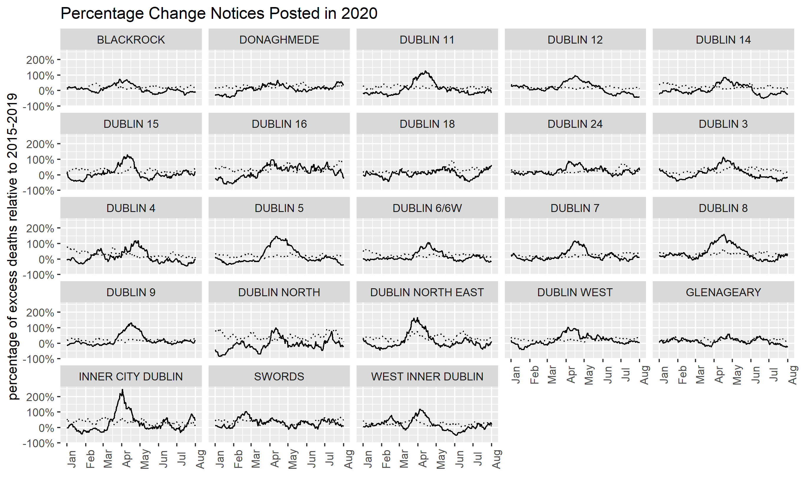
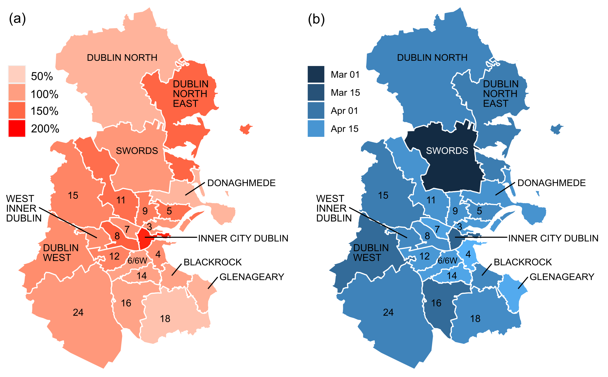
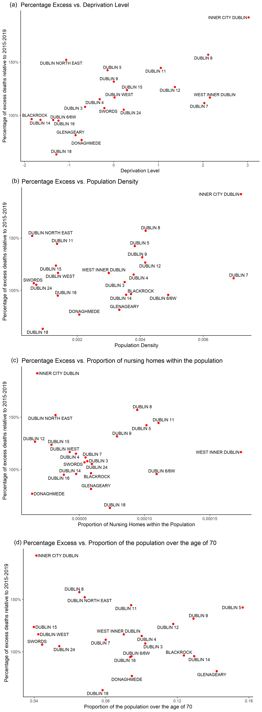

Using RIP.ie as an indicator of excess mortality linked to Covid-19, we explored the deeper patterns associated with excess mortality in Dublin, which has now become a hub for the resurgence of the disease, to examine why the disease has had different impacts within the county. In this blog we investigate the underlying factors that have affected the levels of mortality associated with Covid-19 within Dublin.

Due to the increasing prevalence of Covid-19 in Ireland’s capital city, concern has been rising within the country as to how the resurgence of the disease will impact the county. An indicator of the impact of Covid-19 within the county is the examination of excess deaths reported within different areas of Dublin, and to identify underlying factors that relate to the impact on the population in each area. To do this, we examined the excess death notices posted to RIP.ie in Dublin.  

Using RIP.ie deaths notices, we grouped Dublin Postal Codes together to examine the number of excess postings from January-September 2020. To get a more accurate picture of the significance of Covid-19 mortality in Dublin, we analysed the notices posted in 2020 to RIP.ie relative to the previous five years.  Examining monthly notices posted to RIP.ie relative to previous years allowed us to pick out areas in Dublin most affected by the disease in terms of excess mortality.  

# Has Covid-19 affected Dublin’s districts equally? 

Underlying patterns identified within Dublin show that the disease does not affect all regions equally. Regions naturally vary in socio-economic levels, population density, and age structure, making some regions more vulnerable to the impacts of Covid-19 than others. Four issues we focused on were:  

*    the deprivation level of regions, 
*    population density within districts, 
*    the age structure of districts, 
*    the number of nursing homes reporting Covid-19 deaths in districts. 

To investigate if these issues were related to excess mortality associated with Covid-19, we referred to Dublin’s 3-digit eircodes which roughly corresponded to the old Dublin postal districts. Furthermore, postal codes were chosen as a suitable base geography due to their size and organisation along town/village lines, similar to the RIP.ie database. A target of an average of 10 posts per month was needed for robust identification of excess mortality, which meant that certain postal codes needed to be grouped together as collective districts. These districts are listed in below.  

District   | Individual Postal Code
------------- | -------------
Dublin North  | Balbriggan, Garristown, Oldtown, Ballyboughal
Dublin North East  | Lusk, Skerries, Rush, Malahide
Dublin West | Lucan, Dublin 22
West Inner Dublin | Dublin 20, Dublin 10
Dublin 6/6W | Dublin 6, Dublin 6W
Inner City Dublin | Dublin 1, Dublin 2
Donaghmede | Dublin 13, Dublin 17

```{r, out.width='100%', fig.align='center', fig.cap='Percentage change in notices posted onto RIP.ie in each Dublin district. Eighteen out of the 23 districts within Dublin showed a peak in excess posting 100% above normal in early 2020, illustrating the effects of Covid-19. The dotted line in each plot represents the previous maximum level of notices posted onto RIP.ie.'}

```
The relative change of notices posted onto RIP.ie in each Dublin area is shown above.  Twenty-one out of twenty-three districts showed a clear peak over the previous maximum during March and April in the first wave of the pandemic. Certain districts such as inner-city Dublin (which has shown two smaller peaks in June and July following its April peak), Dublin North East, and West inner Dublin have begun to show a slight rise over the previous maximum and could indicate early effects of the current spike in cases.  

Comparing Dublin’s districts, we see that each district experienced differing fluctuations in relative mortality. If we assume that districts with high peaks in relative mortality were associated with Covid-19, it is important to understand why some districts were more intensely affected by the disease than others. At first glance, it could be assumed that the districts that experienced higher peaks are associated with higher population density. However, this proved not to be the case.  


```{r, out.width='90%', fig.align='center', fig.cap='(a) The ratio of notices posted to RIP.ie in each Dublin district (b) The date of the maximum number of death notices posted to RIP.ie in each Dublin district.  '}

```

The maximum excess reached and the date that each district reached its maximum number of postings on RIP.ie is shown in Figure 2. The date of maximum ranged from March through the end of April as the impacts of the virus were felt across the county during the first wave of the pandemic (Figure 2b). For instance, the early peak in mortality in Swords during the first wave in March could potentially indicate where the virus first began, particularly due to its proximity to Dublin Airport.  

Figure 2a offers a picture of how these districts were affected in terms of excess mortality associated with Covid-19. Figure 2a shows the ratio of notices posted onto RIP.ie to each Dublin district. To calculate the ratio of deaths notices to each Dublin district, we needed to calculate the mean number of monthly notices in each district for the previous five years. The monthly notices of each district in 2020 were then divided by the mean monthly notices to get a monthly ratio for each district in 2020. The maximum monthly ratio was then assigned to each district. Acquiring the ratio of each district allowed the mortality data to be standardised for each district, highlighting potential districts that were worse affected by Covid-19. Few districts in Dublin had peaks in excess mortality less than twice the normal levels. However, there does not appear to be a striking geographical pattern in this picture.  

```{r setup, include=FALSE}
knitr::opts_chunk$set(echo = FALSE)
```

# Structural characteristics that affect mortality levels in Dublin 

We considered four factors that have been associated with high Covid-related excess mortality: deprivation, population density, age structure, and density of nursing homes in a district.  

When examining these factors, the strength of the relationship between each variable and mortality was quantified using the correlation coefficient. When calculating the correlation coefficient, returned values range from -1 and 1, where 0 indicates no linear relationship and 1 indicates a perfect positive linear relationship. Once we acquired a value for the correlation between each variable, we calculated the p-value associated with each variable to determine the significance of our results and to ensure that the results were not due to chance. The lower the p-value, the greater the statistical significance of the relationship between the variables.  

Deprivation has been controversially associated with general excess mortality at a global scale. Harvard Medical School (2020) has acknowledged that assuming the virus is non-discriminating is ‘not the complete truth’; it is areas that are ‘already vulnerable by way of social and economic disadvantage’ that are most at risk of  higher levels of mortality associated with the virus.  

A structural characteristic that dominates the health of an area, and in turn the ability of a population to withstand the impacts of Covid-19, is the socio-economic position of that area. Harvard Medical School (2020) recognise low socio-economic status affect our life expectancies, where we live, the nature of the job we have, the level of education we obtain and the size of our income (Harvard Medical School, 2020). These factors can directly influence the risk of contracting Covid-19, and as a result, influence the level of mortality in areas. For instance, where people can afford to reside can have an immediate impact on their risk of contracting the disease and living in shared housing can result in decreased ability to physically distance (Harvard Medical School, 2020). The same can be said for low-skilled jobs that require public contact, jobs that are frequently worked by the economically disadvantaged (Harvard Medical School, 2020). In addition, many people that reside in more deprived areas do not have the option of working from home and rely on public transport as a means of travelling to work, immediately putting themselves at risk of encountering the disease.  

Furthermore, individuals living in deprived areas are more likely to have ‘less access to high quality healthcare, and suffer from more illnesses that are associated with high mortality, such as diabetes, heart disease, and pulmonary issues’ (Frontiers, 2020). The rapid spread of Covid-19 within these areas could therefore have catastrophic impacts in terms of mortality. 

Thus, we decided to look at the deprivation levels of each district in Dublin to investigate if the varying socio-economic characteristics of each district was linked to high excess mortality. The percentage of excess deaths relative to 2015-2019 in each district is plotted against the area averaged deprivation level in Figure 3a. Although applying the index to each district had the effect of smoothing the internal variation within districts, it acted as an effective general indicator. The index is scaled between -2 and +3, such that +3 represents areas that are more socially and economically disadvantaged. We divided the deprivation index of each district into five equal parts, each being one-fifth of the range between least deprived and most deprived. Districts identified with high peaks in Figure 1 such as inner-city Dublin, Dublin 11, Dublin 8, Dublin 7, Dublin 12 and West Inner Dublin follow a pattern of higher excess mortality associated with a high deprivation level. Dublin’s most deprived districts, inner-city Dublin and Dublin 8, had 50% higher relative excess deaths posted to RIP.ie than Dublin’s least deprived districts, such as Blackrock. The correlation between percentage of excess deaths relative to 2015-2019 and deprivation index was 0.7. To check the sensitivity of the correlation strength to inner-city Dublin, we removed this point. In this case, the correlation between the two variables decreases to 0.5, still showing a strong positive relationship between the two variables and confirming a potential pattern between Covid-related excess mortality and deprivation level with a p-value of 0.00063.  

```{r, out.width='100%', fig.align='center', fig.cap='Percentage of excess notices posted onto RIP.ie plotted against (a) Deprivation Index, (b) Population Denisty, (c) Proportion of population over the age of 70, and (d) Proportion of Nursing Homes (which reported Covid-related deaths) within the population. '}

```

Our World in Data (2020) linked London’s high excess mortality associated with Covid-19 with its high density and hard-to-avoid close physical contact on public transport and at work. Accordingly, it is assumed that countries with a higher fraction of adults in locations will be more inclined to have higher excess death rates (Our World in Data, 2020), and in Dublin the common use of public transport in comparison to the rest of the country allows for the population of the county to come into frequent contact which each other. 

Furthermore, it was identified that in the initial outbreak of the disease, care homes were ill-prepared to effectively combat the spread of Covid-19 within their institutions, having insufficient PPE and insufficient access to Covid-19 tests. Consequently, residents were not well-shielded from potential infection from visitors and staff when the virus was in its inception (Our World in Data, 2020).  

Given the high density of particular areas in Dublin and that 60% of Covid-19 related deaths in Ireland were associated with care homes (The Irish Times, 2020) due to the virus affecting the older portion of the population, we decided to investigate if population density, age structure and the proportion of nursing homes in each Dublin district impacted mortality levels associated with Covid-19.  

Figure 3b plots the percentage of excess deaths relative to 2015-2019 against the population density of each Dublin district. Figure 3b indicates that, while some districts such as inner-city Dublin, a densely populated district, are more vulnerable to the disease, there is not a robust correlation between high excess mortality and population density. The correlation between the two variables returned a value of 0.3, indicating a moderate positive linear relationship. However, removing inner-city Dublin, the correlation between the two variables decreases to a value of 0.08, indicating no linear relationship. With a p-value of 0.122, the relationship between the two variables was not significant.  

Figure 3c plots the percentage of excess deaths relative to 2015-2019 against the proportion of the population over 70 years old in each district (Figure 7). The correlation between the two variables returned a value of -0.3, indicating a negative linear relationship (p-value:0.2479).  

Figure 3d plots the percentage of excess deaths relative to 2015-2019 against the proportion of nursing homes within the population of each district. The correlation between the two variables returned a value of 0.01, indicating no linear relationship (p-value:0.9486).  

# Conclusions 

From our examination of factors that may affect levels of Covid-related mortality in Dublin, we have quantitatively established that societal positions that persist throughout districts in Dublin have a significant influence on mortality levels related to Covid-19. The significant relationship that exists between Covid-related mortality and area deprivation confirms that Covid-19 has differential impacts on Dublin’s population depending on which district the population resides in. This suggests that approaches to combat the impacts of Covid-19 in Dublin should take into consideration the socio-economic dynamics that exist throughout the county.  

The fundamental problem is that the restrictions set up to effectively avoid contracting the virus automatically shield the portion of population that are socially and economically more privileged, while the remainder of the population that reside in more deprived districts, who are less able to adapt to restrictions, are disregarded and more likely to be impacted more by the effects of the virus. For one worker with a stable, well-paying job, restrictions may mean working from home and being protected from the virus. For another worker, restrictions may not provide such security and they may face the choice of going to work, and increasing their risk of contracting the virus, or staying at home and sacrificing their income.  

# Bibliography 

Cullen, P & Holland, K (2020) Nursing or care homes account for almost 60% of coronavirus-related deaths, The Irish Times [online] 21 April 2020. Available at: https://www.irishtimes.com/news/health/nursing-or-care-homes-account-for-almost-60-of-coronavirus-related-deaths-1.4233679 (accessed 24 September 2020). 

Frontiers (2020) Poverty and Covid-19: Rates of Incidence and Deaths in the United States During the First 10 Weeks of the Pandemic [online]. Available at: https://www.frontiersin.org/articles/10.3389/fsoc.2020.00047/full (accessed 24 September 2020). 

Harvard Medical School Centre For Primary Care (2020) The Coronavirus Does Discriminate: How Social Conditions are Shaping the Covid-19 Pandemic [online]. Available at: http://info.primarycare.hms.harvard.edu/blog/social-conditions-shape-covid (accessed 24 September 2020). 

Our World in Data (2020) A pandemic primer on excess mortality statistics and their comparability across countries [online]. Available at: https://ourworldindata.org/covid-excess-mortality (accessed 24 September 2020). 

Distill is a publication format for scientific and technical writing, native to the web.

Learn more about using Distill at <https://rstudio.github.io/distill>.

