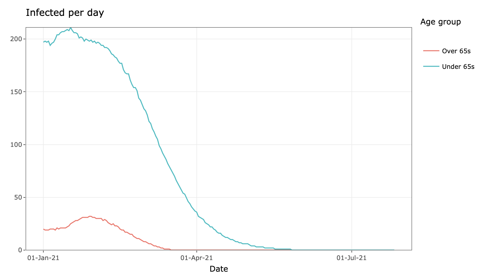
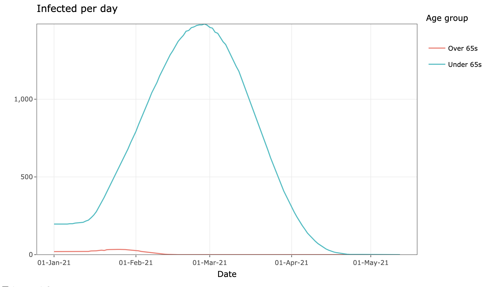

```{r setup, include=FALSE}
knitr::opts_chunk$set(echo = FALSE)
```

Happy new year! Imagine it is January 1st, 2021, and you’ve just switched on the news to see that one of the [many many](https://www.nytimes.com/interactive/2020/science/coronavirus-vaccine-tracker.html) COVID-19 virus vaccines in development has finally been approved, manufactured at the required scale and is ready for distribution.

Surely this means we can all run out in the street and celebrate? Well, not so fast buddy, because now we have to work out who to give it to and how much vaccine we have to distribute.

(Not to mention all of the other issues with new vaccines such as efficacy, anti-vaxx sentiment, delivery methods, delivery choice, etc, etc).

Let’s suppose for a moment that on January 1st 2021 about 5,000 people are currently infected with the virus in Ireland (you can adjust these numbers yourself later), and that about 300,000 people in the country have already had it and they recovered or sadly they died. 

Let’s similarly suppose that the R number (a measure of how many people one person with the virus infects) for under 65s is about 1.5 and the R number for over 65s is about 0.8. For further details about this breakdown see [this post](https://www.hamilton.ie/covid19/posts/2020-10-30-is-shielding-the-elderly-a-useful-strategy-for-ireland/).

And now, in this imaginary scenario, we can add in a vaccine. We don’t know exactly how many doses of a successful vaccine Ireland will obtain. So we’ve made the initial assumption that we will deliver about 20,000 doses a day to people in Ireland, and we can just keep vaccinating until everybody has either had the disease or has been vaccinated. This seems to be in line with the HSE's purchase of [seasonal flu vaccines](https://www.hse.ie/eng/health/immunisation/news/fluvaccinedelivery.html).

But how effective will the vaccine be? This again is hard to know, but a [ recent article referencing Anthony Fauci](https://www.theatlantic.com/health/archive/2020/09/does-coronavirus-vaccine-need-to-be-perfect/616441/) suggests that perhaps if 75% of the population got immunity through vaccination, this would be useful. We’ve been optimistic and put in 90% (UPDATE: [this is no longer optimistic](https://www.bbc.com/news/health-54873105)).

As a final assumption, we have assumed that we might want to vaccinate those most vulnerable (i.e. the elderly) as a priority, so we set 18,000 vaccinations per day for those over 65, and 2,000 vaccines per day for the under 65s.

Following all those assumptions this is the app you get (click refresh in the bottom left if the app has timed out):

<iframe src="https://rstudioserver.hamilton.ie:3838/users/aparnell/SEIR_vaxx/" class="l-screen-inset shaded" height = "800px"></iframe>

You can see the daily number of infections in the graph on the right hand side, starting on the first of January and progressing until the virus is extinct. Hover your mouse over the graph to see the figures for each day. With the default values you end up with very few infections in the over 65s which is great, but the virus really burns through the under 65 group. If you can’t the see the numbers clearly click on the log scale option at the bottom of the plot. Those default values suggest the virus will still be with us until the end of the summer.

But what if you disagree with our numbers? Then feel free to change them! If it seems unrealistic to have such a high R number, because we could still have some kind of restrictions from January onwards, then reduce the R numbers. Reducing the R number down to 0.6 gives this plot:

```{r}

```

Now it seems that the number of cases will be low but it will still be May before the virus is completely gone.

As a final scenario, what would happen if we had a much bigger supply, and could vaccinate 50,000 per day of both over and under 65s? You can create this by dragging the vaccine sliders all the way to the right. This is the plot now:

```{r}

```

Even with far more vaccine, it's May before we end up being free of COVID. It's going to be a while before we're past this pandemic.

If you are not from Ireland, you can change some of the options (e.g. the population size) in the extra options obtained from clicking on the button at the bottom of the slider bars. 

It’s likely that we will expand this app out in the coming weeks to include extra factors.  If you have other suggestions, or better default values we’d really like to [hear from you](mailto:andrew.parnell@mu.ie). 