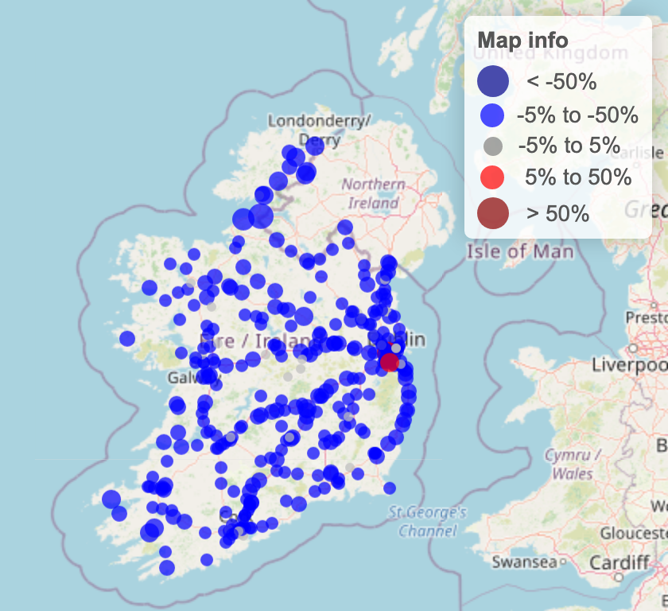
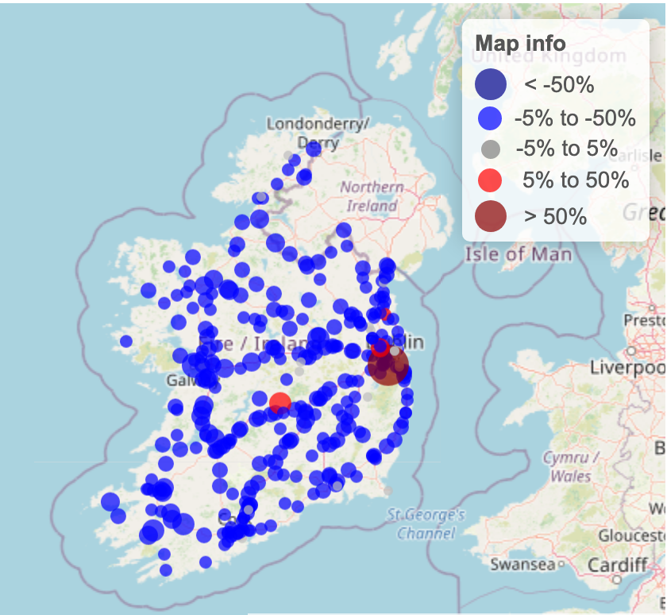
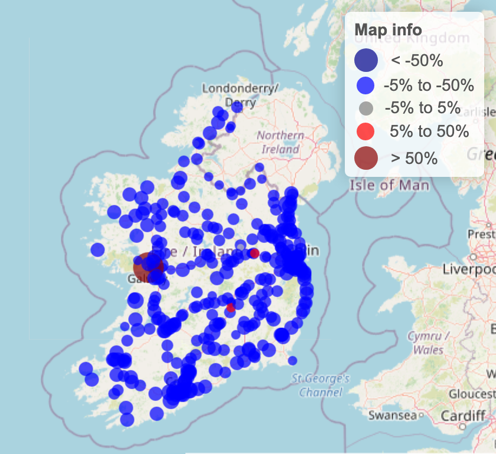

```{r setup, include=FALSE}
knitr::opts_chunk$set(echo = FALSE, 
                      message = FALSE,
                      warning = FALSE,
                      fig.align = 'center', 
                      fig.show = 'H')

library(tidyverse)
library(dplyr)
library(plotly)
library(lubridate)
library(zoo)
library(gridExtra)
```


On July 27th we published an article in which we tried to answer the question “Was there a spike in COVID-19 cases due to the differently-timed lockdowns along the Irish border?” 


In that [article](https://www.hamilton.ie/covid19/posts/2020-07-27-traffic-analysis/),, we analysed traffic data to see whether there was a different pattern in people’s movement along the Irish border compared to the rest of the Republic of Ireland. Based on our analysis, we saw no significant difference, and so we cannot blame people living near the border in Northern Ireland for importing the virus into the Republic.

However, the question still remains. Recently the [Taoiseach](https://www.irishtimes.com/news/ireland/irish-news/we-are-deeply-concerned-officials-report-611-new-covid-19-cases-five-further-deaths-1.4374444) said the Government is “particularly concerned about Northern Ireland” and the consequences of traffic coming from the North. Furthermore, public health expert Dr Gabriel [Scally](https://www.irishtimes.com/news/health/call-for-all-island-plan-as-covid-19-cases-rise-in-donegal-1.4407872) said: “The Irish border has always been porous and people have always moved across it.”

So we decided to update our assessments using new data, which had been updated until 27th of October 2020. This time we are also introduced a new approach for visualising the traffic patterns, and this helped us see that the newer restrictions are also linked with less traffic in border counties How did we do it? 


## New Traffic Analyser Application


We scraped the Transport Infrastructure Ireland [website](https://www.nratrafficdata.ie/c2/gmapbasic.asp?sgid=ZvyVmXU8jBt9PJE$c7UXt6) to update our dataset, which now covers all the days from the beginning of 2019 until the 27th of October 2020. We developed an application that lets you simply select two time periods and compare the daily average number of cars passing by the traffic stations.

So let’s check If people’s movement in cars, especially people living alongside the border, was affected by the new restrictions that limit travelling. 

How the app works: 

1. Choose two periods. The app will calculate the percentage change in traffic levels for all of the traffic stations. It shows the stations with a reduction in traffic levels in blue dots, while those with an increase in traffic levels appear as red dots. Also, the size of the dots indicates the magnitude of change.


2. You can click on the stations on the map and a popup will show up, stating the percentage change number.


3. You can also check the data used for the percentage calculation just by selecting a station and clicking on the plot button.


<iframe src="https://aminshn.shinyapps.io/Traffic_APP/" class="l-screen-inset shaded" height = "800px" width = "850px"></iframe>


## Assessing Pandemic Effects on Traffic Levels

In this section, we’ll try to see how effective the new restrictions have been. We are going to compare two periods: two weeks before and two weeks after the restrictions. Specifically, we will try to answer the below questions -


* Were there more cars than usual (compared to other parts of the country) crossing the border before the recent restrictions on travelling were imposed?


* Did the number of cars crossing the border change after the restrictions were imposed?


* Did a specific level of restrictions stop the spread of traffic across the border?


### County Donegal was put on level 3 restriction from September 25th:

How effective was this restriction? We can get an idea by comparing the changes in traffic levels before and after the September 25th 2020.

(You can also try this for 2019 as a benchmark, to get an idea about what it would look like if there was no pandemic or any restrictions. But here we will be focusing only on 2020.) 

So if we select the first period from September 11th to 25th and the second period from September 26th to October 10th we get the below figure:

\

```{r, echo=FALSE, fig.align='center'}

```

*Figure1. Percentage change in traffic levels comparing two weeks before the Donegal’s restriction to two weeks after the restriction.* 


\

According to figure 1, it is obvious that majority of the stations have experienced a drop in traffic levels after the restriction. The most dramatic drop at “N03 Between Belleek and Ballyshannon, Templenew, Co.Donegal” shows a 49% reduction in traffic levels. Furthermore, we can see that all of the stations in Donegal are blue, and have relatively bigger dots compared to other counties’ stations. 

In other words, the traffic levels declined in all of the traffic stations in Donegal, and the decline was bigger  than the decline in other counties during that period.


### All the counties were put on level 3 restriction from October 6th:

Using the same approach, if we set the first period from September 21st to October 5th and the second period from October 6th to 20th and we get the below figure:


\

```{r, echo=FALSE, fig.align='center'}

```

*Figure2. Percentage change in traffic levels comparing two weeks before the all counties’ level 3 restriction to two weeks after the restriction.*

\

Figure 2 shows that most of the stations experienced a significant drop in traffic levels after the restriction, anda few stations show an increase in traffic levels. We notice that all of the border stations are blue and the percentage changes in those stations show that most of them have values close to the total average of changes.This tells us that the restriction affected them similar to the rest of the country.


### All the counties were put on level 5 restriction from October 21st:

This is the most recent restriction put in place, and we currently have only 5 days of data after this lockdown. So this time we are going to compare 5 days before the lockdown to 5 days after it. Accordingly, we set the first period from October 15th to 20th and the second period from October 21st to 26th. Doing so, we get the below figure:


\

```{r, echo=FALSE, fig.align='center'}

```

*Figure3. Percentage change in traffic levels comparing five days before the level 5 restriction to five days after the restriction.*

\

Figure 3 clearly shows that most of the stations are showing a substantial drop in traffic levels, except for a few. Again, in line with other stations across the country, border stations experienced a reduction in traffic levels.


### Looking at the bigger picture:

So far, we have compared different cross-sections of time with each other. But it is also worth looking at the longitudinal data, or the changes for locations over time 

For this,we are going to plot the average traffic level time series. And just to see if there were significant differences among border counties compared to the total average of other non-border ones,we are going to separate border counties’ time series from the rest of the country.

\

```{r fig.width = 10, fig.height = 7}

df_total <- readRDS("df_total.rds")


donegal <- df_total %>% filter(grepl("Donegal",location)) %>% mutate(county = "Donegal")  %>% group_by(date) %>% summarise(value = mean(value, na.rm = T), county = min(county)) %>% mutate(mavg = rollmean(value, 7, fill = NA))

leitrim <- df_total %>% filter(grepl("Leitrim",location)) %>% mutate(county = "Leitrim")  %>% group_by(date) %>% summarise(value = mean(value, na.rm = T), county = min(county))%>% mutate(mavg = rollmean(value, 7, fill = NA))

cavan <- df_total %>% filter(grepl("Cavan", location)) %>% mutate(county = "Cavan")  %>% group_by(date) %>% summarise(value = mean(value, na.rm = T), county = min(county))%>% mutate(mavg = rollmean(value, 7, fill = NA))

monaghan <- df_total %>% filter(grepl("Monaghan",location)) %>% mutate(county = "Monaghan")  %>% group_by(date) %>% summarise(value = mean(value, na.rm = T), county = min(county)) %>% mutate(mavg = rollmean(value, 7, fill = NA))

louth <- df_total %>% filter(grepl("Louth",location)) %>% mutate(county = "Louth")  %>% group_by(date) %>% summarise(value = mean(value, na.rm = T), county = min(county)) %>% mutate(mavg = rollmean(value, 7, fill = NA))

rest <- df_total %>% filter(!grepl("Louth|Monaghan|Cavan|Leitrim|Donegal",location)) %>% mutate(county = "Non border counties average")  %>% group_by(date) %>% summarise(value = mean(value, na.rm = T), county = min(county)) %>% mutate(mavg = rollmean(value, 7, fill = NA))

all <- rbind(donegal, leitrim, cavan, monaghan, louth , rest)

all2 <- all %>% filter(date >= "2020-01-01") %>% group_by(county) %>%
  mutate(bench = mean(value[which(month(date) == 1 | month(date) == 2)],na.rm = T)) %>% 
  mutate(change = rollmean((value - bench)/bench, 7, fill = NA))

# p <- all %>% ggplot(aes(date, round(value), color = county)) + geom_line() + theme_bw() + 
#   geom_vline(xintercept = as.numeric(as.Date("2020-03-13")),linetype="dotted") +
#   geom_vline(xintercept = as.numeric(as.Date("2020-03-27")),linetype="dotted") +
#     geom_vline(xintercept = as.numeric(as.Date("2020-09-25")),linetype="dotted") +
#     geom_vline(xintercept = as.numeric(as.Date("2020-10-06")),linetype="dotted") +
#     geom_vline(xintercept = as.numeric(as.Date("2020-10-21")),linetype="dotted") +
#   scale_x_date(breaks = "2 weeks", date_labels = "%d-%b") +
#   scale_y_continuous(breaks = scales::pretty_breaks(n = 7))  +
#   theme(axis.text.x = element_text(angle = 45, size = 10)) + 
#   labs(x = 'Date', y = 'Number of cars per day', 
#        title = "Traffic level changes in border vs non border Irish counties in 2020 (Vertical lines indicate lockdown dates)") + guides(color=guide_legend(title="County"))

p1 <- all %>% filter(date >= "2020-01-01") %>% ggplot(aes(date, mavg/1000, color = county)) + geom_line() + theme_bw() + 
  geom_vline(xintercept = as.numeric(as.Date("2020-03-13")),linetype="dotted") +
  geom_vline(xintercept = as.numeric(as.Date("2020-03-27")),linetype="dotted") +
    geom_vline(xintercept = as.numeric(as.Date("2020-09-25")),linetype="dotted") +
    geom_vline(xintercept = as.numeric(as.Date("2020-10-06")),linetype="dotted") +
    geom_vline(xintercept = as.numeric(as.Date("2020-10-21")),linetype="dotted") +
  scale_x_date(breaks = "2 weeks", date_labels = "%d-%b") +
  scale_y_continuous(breaks = scales::pretty_breaks(n = 7))  +
  theme(axis.text.x = element_text(angle = 45, size = 10)) + 
  labs(x = 'Date', y = 'Number of cars per day (x 1000)', 
       title = "Traffic level changes in border vs non border Irish counties in 2020") + guides(color=guide_legend(title="County"))

p2 <- all2 %>% ggplot(aes(date, change*100, color = county)) + geom_line() + theme_bw() + 
  geom_vline(xintercept = as.numeric(as.Date("2020-03-13")),linetype="dotted") +
  geom_vline(xintercept = as.numeric(as.Date("2020-03-27")),linetype="dotted") +
  geom_vline(xintercept = as.numeric(as.Date("2020-09-25")),linetype="dotted") +
  geom_vline(xintercept = as.numeric(as.Date("2020-10-06")),linetype="dotted") +
  geom_vline(xintercept = as.numeric(as.Date("2020-10-21")),linetype="dotted") +
  geom_hline(yintercept = 0,linetype="dotted") +
  scale_x_date(breaks = "2 weeks", date_labels = "%d-%b") +
  scale_y_continuous(breaks = scales::pretty_breaks(n = 7))  +
  theme(axis.text.x = element_text(angle = 45, size = 10)) + 
  labs(x = 'Date', y = '% change from the average before the pandemic') + guides(color=guide_legend(title="County"))

grid.arrange(p1,p2, nrow = 2)

```
*Figure4. Top: shows the average traffic levels for the five border counties plus the average traffic level of all other non border counties shown in different colours. Bottom: shows the percentage change in traffic levels relative to the first two months of the year for the same counties. Vertical lines indicate lockdown dates.*

\

In figure 4, average traffic levels of different counties are plotted over time in different colours. Note that we are using a 7-day moving average to smooth the daily values. 

According to the top panel of the figure, none of the border counties except Louth have experienced traffic levels above the total average of the non-border counties since the beginning of the year. County Louth has had slightly more than the average traffic levels, even before the pandemic hitting Ireland.

In the bottom panel of the figure, the y-axis represents the percentage change in traffic levels relative to the overall average of traffic levels (including all the stations) in January and Feburary 2020 when there was little sign of COVID-19 in Ireland. As we can see, all of the stations experienced a significant drop or negative change in traffic levels in March and April, but as we get closer to summer an interesting pattern emerges.We see that all the border counties, again except Louth, experience positive percentage changes, e.g. +40% for Donegal in August, as opposed to the average changes of non-border counties that never went above the zero percentage line after the first two lockdowns. 

However, we can confirm that border counties have been responsive to the three new lockdowns (see above) and they are converging to the non-border counties by experiencing roughly equal negative percentage changes in October.


### Conclusion:

Our data shows that border traffic stations reported similar trends to other traffic stations across the country in response to governmental restrictions. We showed that all of the recent restrictions were linked with noticeable reductions in traffic levels, including traffic levels in the border counties. 
