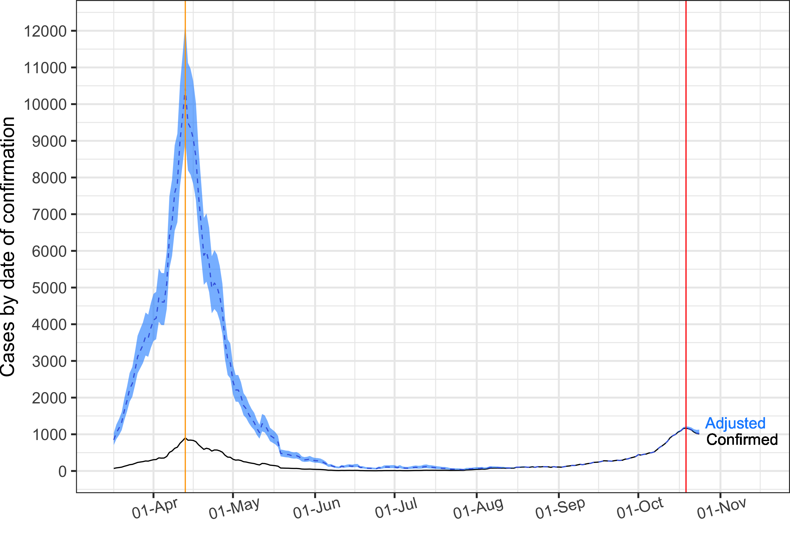
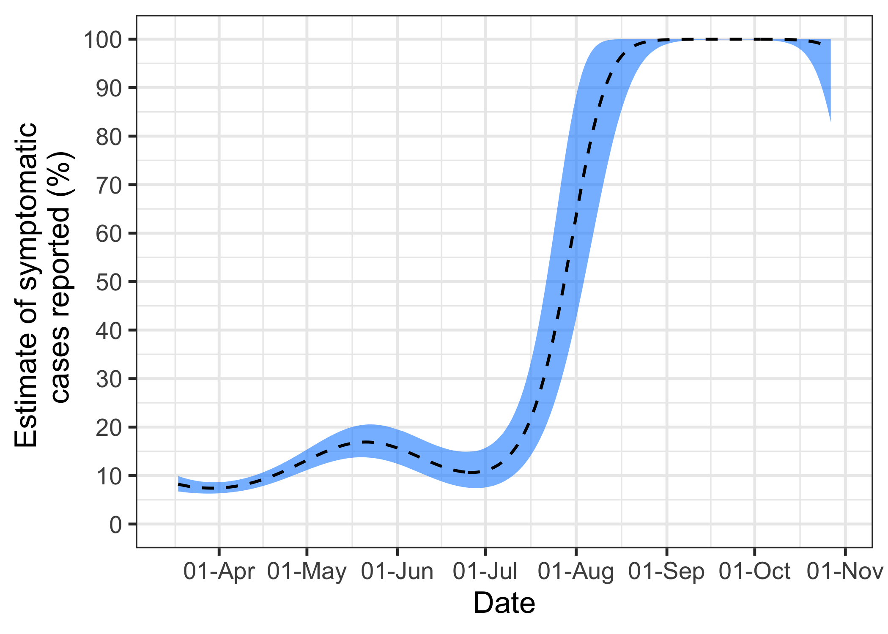
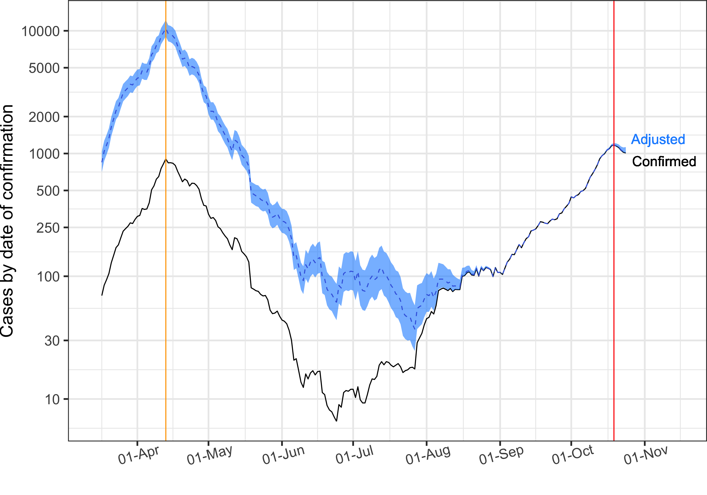
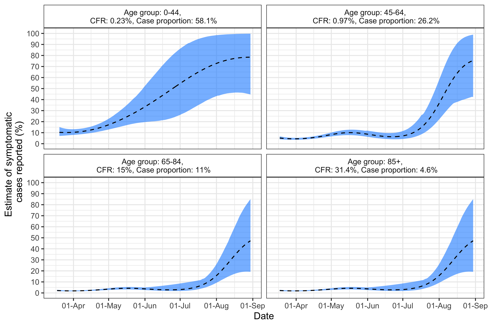
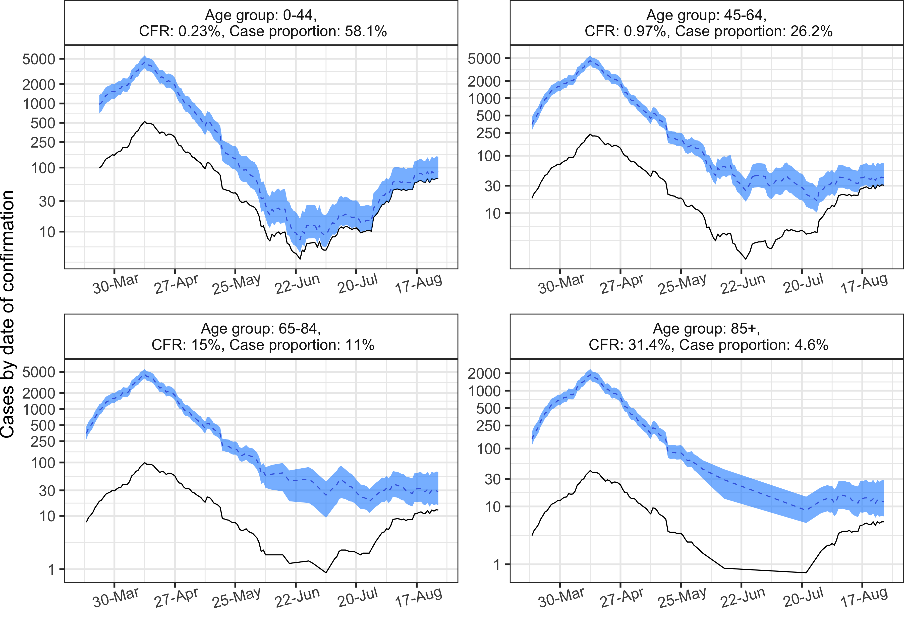

```{r setup, include=FALSE}
knitr::opts_chunk$set(echo = FALSE, fig.align = 'center', fig.show = "H")
```
In March and April, the Government of Ireland wasn’t able to put in place widespread testing for COVID-19. We didn’t hit 100,000 tests per week until [Mid-April](https://www.gov.ie/en/press-release/1826d2-statement-from-the-national-public-health-emergency-team-tuesday-21-/), and it was [September](https://covid19ireland-geohive.hub.arcgis.com/pages/hospitals-icu--testing) before we reached one million tests per week. 
We can assume that this led to under-reporting of cases, and that people who had a COVID-19 infection (asymptomatic)
were not diagnosed and reported.

But how many cases of COVID-19 were we not detecting in the early months of the pandemic? In this article we use methods developed by the [London School of Hygeine and Tropical Medicine](https://researchonline.lshtm.ac.uk/id/eprint/4658145/) to estimate the real size of the initial wave of COVID-19.


You can read more about how we did it below, but this plot shows our best estimate of the number of cases from March up until early November:

```{r}

```

The Figure suggests that the first wave had massively more cases than that of the second.

## How we did it

To infer the level of case under-reporting, we estimated what is known as the case under-reporting ratio. This is the ratio of reported symptomatic cases to the true number of infected[?] individuals. We calculated this from the confirmed number of deaths, the confirmed number of cases, and the case fatality rate of the virus (initially here assumed to be 1.4\%, with a confidence interval of 1.2-1.5\%).

We start with the estimated case fatality rate and the number of reported deaths. Now, if a person dies of COVID-19 on the 15th May, for example, we can guess that they contracted the virus about 2-3 weeks before that date. If there were 500 cases reported on the 1st May and the case fatality rate was 1%, we would expect there to be around 5 deaths on the 15th May. If there were actually 20 deaths, it means we have under-estimated the number of case by a factor of 4. We have an under-reporting ratio of 25%.

In other words, if the observed number of deaths differs a lot from the number of expected deaths then, assuming that the case fatality rate is a good approximation of the truth, we can infer that the reported number of cases is incorrect and underestimated.

Clever maths now takes over, and we use a statistical smoothing model known as a Gaussian Process to calculate the expected under-reporting rate over time. This has the advantage of giving us an uncertainty estimate on the number of cases, as you can see in the blue uncertainty ribbon in the plots - the wider the ribbon, the larger the uncertainty. In Figure 2 we show the results for the estimated percentage of symptomatic cases actually being reported from mid-March to the start of November.


```{r}

```


This estimated percentage stays around 20\% for the period of March to July, which can be considered the beginning of the pandemic. At the same time, we can add in the testing data to see that very few tests were performed per new confirmed case. We really were not doing a good job of testing enough of the population at that point.

After July, we can see the estimated percentage of symptomatic cases starts to go up, implying that the case counts were getting much closer to reality. In the same way, the number of tests per new case increased until August, and dropped again when the number of cases dropped too. By September, we estimate that most cases in Ireland were being reported.

Figure 3 shows the official number of cases and the adjusted number of cases at each time point (now in the log scale), calculated using our under-reporting estimates. We can see that the peak dates for the confirmed number of cases and the adjusted number of cases remained the same - so the ‘wave’ has a similar shape.But the numbers are quite different, so the adjusted wave is bigger. Instead of around 1,000 cases, we estimate that there were more than 10,000 cases in Ireland by mid-April. From August and September on, the adjusted number of cases follows the number of confirmed cases closely.


```{r}

```

## Estimating under-reported cases for different age groups

Our analysis so far assumes that the case fatality rate was the same for the whole population. We can do better, however, by applying different rates for different age groups.

We define four different age groups: 0 to 44 years (58\% of the cases, with 
a CFR of 0.23\%), 45 to 64 years (26.2\% of the cases, with a CFR of 0.97\%),
65 to 84 years (11\% of the cases, with a CFR of 15\%), and 85 or more years (4.6\% of the cases, with a CFR of 31.4\%). The case fatality rates for these
groups are estimated using the official cases data, and the proportion of
cases comes from numbers published by the [HPSC](https://www.hpsc.ie/). 

We followed the same methods above, but we limited this analysis to the period March to August. This is because in the past few weeks there have thankfully been very few deaths, meaning that our estimate of under-reporting gets very noisy for all but the eldest group.

Figure 4, shows more estimated under-reporting for the older age classes, reaching only 10% of cases reported for the period of April to July. After that, the estimate goes up fast and reaches levels close to 60%. For the youngest age class, however, this estimate starts low in April, but increases throughout the months until it reaches 80% by the end of August.


```{r}

```

These results are reflected in Figure 5. These plots tell us that we could have had around 5,000 cases for the first three age classes in the peak of the COVID-19 in Ireland, and around 2,000 for the 85+ years class.

```{r}

```


## Summary
The second wave in reported COVID-19 cases for Ireland, and almost all other countries, has seemed more severe than earlier in 2020, but this could partly be due to more accurate case reporting in the second wave compared to case reporting in the first wave.

We are seeing fewer numbers of deaths from COVID-19 reported in Ireland the second wave compared to earlier in the pandemic. There are probably many reasons for this, but under-reporting could account for it in part. Our analysis suggests that there were around 10,000 cases per day in Ireland by mid-April, 10 times that which was reported.

As with all models, there are some caveats to our analysis. These include:

- We assume a constant case fatality rate. In practice this might have decreased over time which would inflate the second wave more
- We assume that the delayed case fatality rate is a realistic method for converting deaths to cases, and that the delay between cases and deaths is set appropriately
- We assume that the statistical model we use does an adequate job of smoothing over jumps in the daily delay ratios
- As with all our models, we provide our code in our [GitHub](https://github.com/hamilton-institute/covid19ireland) repositories for you to be able to play with or check or results.


